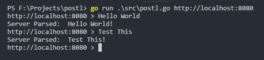

# postl
A repl that posts all user input to the url specified when the repl is started

### Running the client 
`go run .\src\postl.go http://localhost:8080`

### Running the test server
`go run .\test-server\server.go`
